# Coder's Living Instant Journal Web App

LIJ is a secure, cloud-based note-taking app focussed on rapid access and distribution, allowing you to save your notes and thoughts without interrupting your flow. Easily create, retrieve, and update your notes directly from the command line and share them instantly with yourself or others. Set up highly customizable digest schedules to receive running reports of your notes through the use of CLIJ's rich web GUI. Technologies used include React/Redux, Node, Express, Oauth, MongoDB, and JSON Web Tokens, and the project is hosted on Firebase and Heroku. The terminal client is available for download on NPM.

### We are deployed at
https://cli-journal.web.app/

### What is the Coder's Living Instant Journal Web App?
A web app that interacts with the Coder's Living Instant Journal API. The web app provides an easy to use interface that allows you to create, read, update, and delete both journals and entries.  A user has the ability within the app to create e-mail profiles specifying in detail what journals they would like to receive e-mails from and the frequency they would like to receive them.


### Tool Used
* React
* Redux
* Bootstrap
* React Icons
* Sass
* React Hook Form
* Query String
* Redux Thunk
* Superagent
* Uuid
* React-cookies
* VSCode

### Getting Started
Clone this repository to your local machine.

```
git clone https://github.com/Coders-Living-Instant-Work-Journal/coders-living-instant-journal-react-web.git
```

In your terminal
```
$ yarn install

```


### Usage

#### Login page with Github

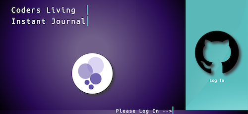

#### Main Page after Login


#### Journals Menu without any journals added. Option to add a new journal.
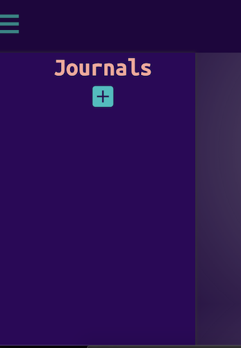

#### Text-box appears after clicking add journal button. 


#### Journals Menu with Journals Added.  Options to edit and delete each journal.
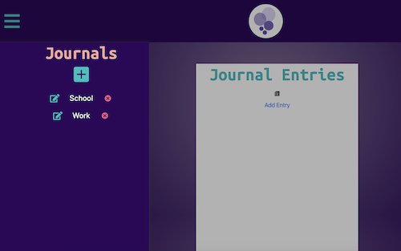

#### Form appears after clicking Add Entry button
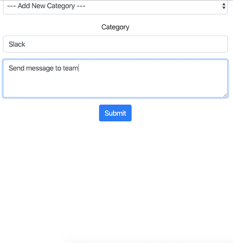

#### Upon submitting the entry form, entries will appear on the main page.
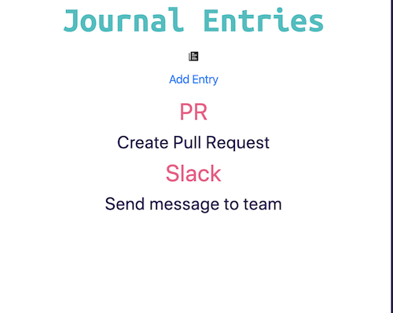

#### Each entry can be clicked, providing a more detailed view with options for edit/delete.
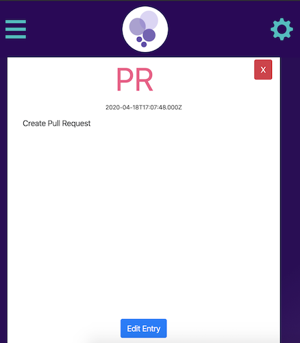

#### Upon clicking edit entry, a form is provided allowing the user to update category and text details.
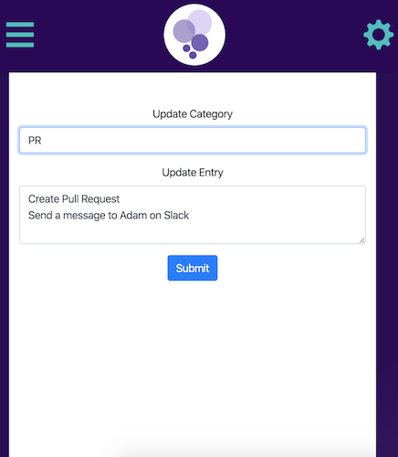

#### Settings Menu has options for setting up e-mail profiles and logout
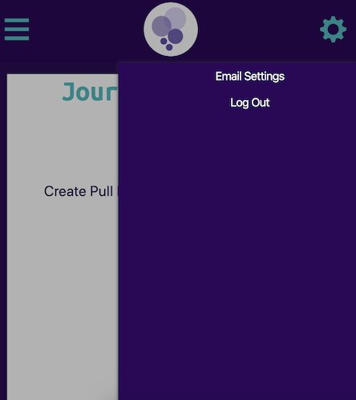

#### Clicking e-mail profiles opens up option to create a new profile


#### Upon clicking Add New, the user will be provided with a form to fill out
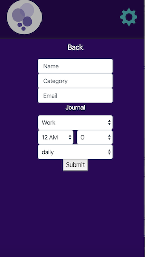

#### The user can fill out the form with the options they desire
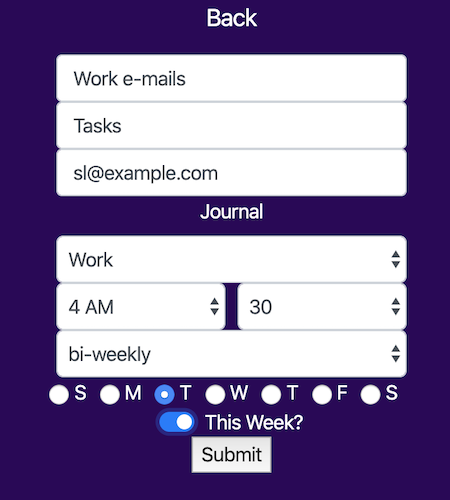

#### Upon submission, the user will now see the e-mail profile they created in their e-mail settings
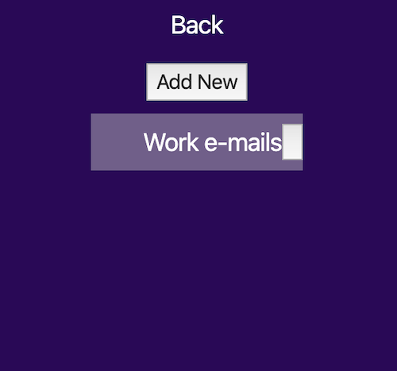


### Authors
 Eugene Monnier, Andrew Kyllo, Peter Cole, Susanna Lakey, Cait Rowland, Tyler Sayvetz, Kevin Dreyer

### Resources


[Github Projects Page for CLIJ Web App](https://github.com/Coders-Living-Instant-Work-Journal/coders-living-instant-journal-react-web/projects/1)


